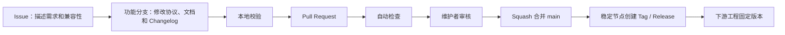

# 整车接口协作与维护方案

## 1. 目标与结论

建立一个归属 `BITFSAE` GitHub Organization 的公开仓库，集中维护整车 CAN DBC、遥测 Protobuf 和与协议直接相关的说明。各固件、上位机、遥测和分析项目只引用这里已经发布的版本，不再各自维护一份“最终版”。

现阶段不再另建私有接口仓库。协议变化不频繁，日常通常由一名维护者交接给下一届的一名维护者；拆成公私两个仓库会增加同步、权限和交接成本。真实凭据与公开协议分离存放即可满足当前需要。

## 2. 为什么需要中央仓库

旧工程中已经出现以下问题：

- 同一份 DBC 或 Proto 被复制到多个工程，修改后难以判断哪份最新；
- `Vehicle_CanB.dbc` 存在不同分支版本，其中一份 GPS/IMU 内容的中文编码损坏；
- 固件、服务器和数据工具可能使用不同字段定义，却缺少明确的接口版本；
- 变更原因、兼容性和审核人没有统一记录。

中央仓库解决“协议以哪里为准”，各业务工程继续负责“如何使用协议”。

## 3. 仓库边界

### 3.1 应放入仓库

- CANA、CANB 的正式 DBC；
- 遥测 `.proto` 与 Nanopb `.options`；
- CAN ID 分配、字段解释、兼容性和迁移说明；
- 脱敏的配置示例；
- 接口验证脚本、Issue/PR 模板和更新记录。

### 3.2 不应放入仓库

- MQTT、数据库、服务器的真实密码或 Token；
- TLS/SSH 私钥与生产证书私钥；
- 生产服务器 IP、账号、SSH 命令和部署拓扑；
- GitHub Actions Secrets 的实际值；
- 未确认再发布权利的厂家资料。

MQTT 关闭匿名连接后，公开仓库只描述认证字段和配置方式。真实用户名、密码和证书分别保存在服务器环境变量、设备受保护配置、GitHub Secrets 或线下交接介质中。示例统一使用 `${MQTT_HOST}`、`${MQTT_USERNAME}`、`${MQTT_PASSWORD}` 这类占位符。

## 4. 目录职责

```text
vehicle-interfaces/
├── can/                         # CANA、CANB、CANC 正式 DBC
├── telemetry/                   # 正式 Proto、Nanopb 配置及使用说明
├── docs/                        # 协作、ID 索引、迁移和待确认事项
├── tools/                       # 自动校验，不生成正式接口源
├── .github/                     # CODEOWNERS、Issue/PR 模板、CI
├── CHANGELOG.md                 # 已完成变更和未发布待办
├── CONTRIBUTING.md              # 提交接口改动的操作要求
└── README.md                    # 新队员入口和文档索引
```

DBC/Proto 是机器可读的字段权威来源；Markdown 负责背景、流程、索引和不能直接表达在协议文件中的约束。两者不应大段重复。

## 5. 角色与一传一交接

### Organization Owner

建议始终保留至少 2 名 Owner，即使平时只有 1 人维护。Owner 只负责组织连续性、成员恢复和仓库管理，不代表每次协议变更都要参与。

### 当前维护者

- 管理 Issue、PR、Release 和访问权限；
- 审核接口是否完整、兼容和可实现；
- 在交接前清理待办并带下一任完成一次真实 PR 和 Release。

### 下一任维护者

- 先作为 `vehicle-interface-maintainers` Team 成员参与审核；
- 能独立完成一次分支、校验、PR、合并、Tag/Release 全流程后再接任；
- 接任后复核 Organization Owner、Team 和外部协作者名单。

一传一不等于只保留一个账号。至少两名 Owner 是为账号丢失和毕业交接兜底；日常维护仍可由一个人负责。

## 6. 变更流程



普通改动至少 1 名维护者审核。不兼容改动、安全控制报文、跨多个系统的改动，原则上由 2 人复核；如果当时只有一名活跃维护者，应至少让受影响系统的负责人参与确认并在 PR 中留下记录。

## 7. 分支与保护规则

`main` 只接收 PR，禁止强制推送和删除，要求：

- 自动校验通过；
- 至少 1 个批准；
- CODEOWNERS 审核；
- 新提交使旧审核失效；
- 对话全部解决；
- 只使用 Squash Merge，并在合并后删除功能分支。

管理员原则上也遵守相同规则。初次建仓的首个提交可由管理员直接推送，保护规则在首个 CI 成功后启用。

## 8. CAN 变更审核清单

- 总线、CAN ID、标准/扩展帧、发送者和接收者明确；
- DLC、周期或触发条件明确；
- 每个信号的起始位、长度、字节序、符号、比例、偏移、单位和范围明确；
- 无效值、超时行为、计数器/CRC 和故障降级明确；
- 与现有 ID 不冲突；
- 已发布字段发生变化时给出兼容和迁移方案；
- DBC、ID 索引、受影响项目说明和 `CHANGELOG.md` 同步修改。

## 9. 遥测变更审核清单

- 已发布字段号不修改、不复用；删除字段使用 `reserved`；
- 单位和缩放写进字段名或注释，避免依赖口头约定；
- `repeated`、字符串和字节字段同步检查 Nanopb 容量；
- MQTT Topic、QoS、保留消息、重连和认证变化有明确版本与迁移说明；
- 真实 Broker、账号和密码不进入仓库；
- 服务器、STM32 与数据工具使用同一个 Proto 版本验证通过。

## 10. 版本与下游使用

接口使用语义化版本：

- `MAJOR`：不兼容修改；
- `MINOR`：向后兼容地新增报文或字段；
- `PATCH`：不改变线缆协议的文档、注释或校正。

下游工程应固定到 Release Tag 或 Commit，并记录版本。例如 Git submodule、CMake FetchContent、发布压缩包或仅复制生成文件都可以，但必须能够追溯到本仓库的 Commit。不要静默跟随 `main`。

## 11. 发布与交接检查

发布前：

1. 所有自动校验通过；
2. `CHANGELOG.md` 将对应内容从“未发布”整理到版本号和日期；
3. 对不兼容变化给出迁移步骤；
4. 创建签名或受保护 Tag，并发布 Release 说明；
5. 通知受影响项目更新固定版本。

交接时：

1. 下一任完成一次真实 PR 和 Release 演练；
2. 复核 Owner、Team、CODEOWNERS 和 Secrets 的访问者；
3. 轮换需要移交的 MQTT/服务器凭据，不在聊天记录或仓库中长期明文保存；
4. 清理离队成员权限；
5. 将仍未确认的事项留在 Issue 和 `docs/迁移与待确认项.md`，不要只口头交接。

## 12. 当前落地顺序

1. 建立公开 Organization 仓库和维护 Team；
2. 迁入当前一致的 CANA、CANB、Proto 和 Nanopb 配置；
3. 以 ECU 同学提供的新版 CANA、CANB、CANC 为基础，合入已经由 PDM、FanController 代码和文档确认的 CANB 报文；
4. 启用自动校验、CODEOWNERS 和 `main` 保护；
5. 由 ECU、数据采集和遥测负责人共同复核新版 CANB/CANC 的实际收发情况；
6. 确认许可证和第三方资料授权后发布 `v1.0.0`。

## 13. GitHub 功能对应

- Organization 与角色：<https://docs.github.com/organizations/managing-peoples-access-to-your-organization-with-roles/roles-in-an-organization>
- Team：<https://docs.github.com/organizations/organizing-members-into-teams/about-teams>
- CODEOWNERS：<https://docs.github.com/repositories/managing-your-repositorys-settings-and-features/customizing-your-repository/about-code-owners>
- 分支保护：<https://docs.github.com/repositories/configuring-branches-and-merges-in-your-repository/managing-protected-branches/about-protected-branches>
- Pull Request：<https://docs.github.com/pull-requests/collaborating-with-pull-requests/proposing-changes-to-your-work-with-pull-requests/about-pull-requests>
- GitHub Actions：<https://docs.github.com/actions>
